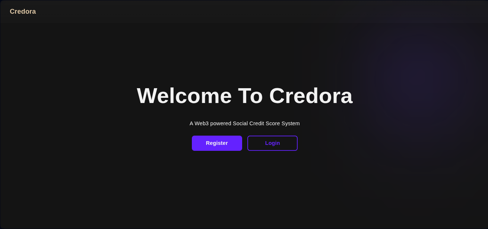

# ContraDots Hackathon Project - Social Scoring System

A blockchain-integrated social scoring system built with Django (backend), React (frontend), and Ethereum smart contracts deployed on polkadot chains.

## 🚀 Quick Start

### Prerequisites

- **Python 3.11+**
- **Node.js 18+** and npm
- **SQLite** (included with Python)
- **Git**

### 1. Clone the Repository

```bash
git clone https://github.com/mirukibs/contradots-hackathon-project.git
cd contradots-hackathon-project
```

### 2. Set Up Backend (Django)

#### Install Python Dependencies

```bash
# Create and activate a virtual environment (recommended)
python3 -m venv venv
source venv/bin/activate  # On Windows: venv\Scripts\activate

# Install dependencies
pip install -r infrastructure-requirements.txt
pip install web3
```

#### Set Up Database

```bash
# Run migrations to create database tables
python3 manage.py migrate

# Create a superuser (admin account)
python3 manage.py createsuperuser
```

#### Configure Environment Variables (Optional)

Create a `.env` file in the project root:

```env
# Blockchain Configuration
WEB3_PROVIDER=https://testnet-passet-hub-eth-rpc.polkadot.io
CONTRACT_ADDRESS=0x7e50f3D523176C696AEe69A1245b12EBAE0a17dd
PRIVATE_KEY=your_private_key_here

# Django Settings
SECRET_KEY=your-secret-key-here
DEBUG=True
```

#### Start Django Server

```bash
python3 manage.py runserver
```

The backend API will be available at `http://localhost:8000`

### 3. Set Up Frontend (React)

Open a new terminal window:

```bash
cd src/viteReact

# Install dependencies
npm install

# Start development server
npm run dev
```

The frontend will be available at `http://localhost:5173`

## 📖 Usage

### Accessing the Application

1. **Frontend**: Open `http://localhost:5173` in your browser
2. **API Documentation**: Visit `http://localhost:8000/api/` for API endpoints
3. **Admin Panel**: Access `http://localhost:8000/admin` with your superuser credentials

### Key Features

- **Activity Management**: Create and manage activities (requires LEAD role)
- **Action Submission**: Submit actions for activities with blockchain proof
- **Proof Validation**: Validate submitted actions (LEAD only)
- **Leaderboard**: View reputation scores and rankings
- **Blockchain Integration**: All activities and actions are recorded on the blockchain

## 🔧 Development

### Running Tests

```bash
# Backend tests
pytest

# With coverage
pytest --cov=src

# Run specific tests
pytest tests/domain/
pytest tests/application/
```

### Project Structure

```
contradots-hackathon-project/
├── src/
│   ├── application/        # Application layer (use cases, DTOs)
│   ├── domain/            # Domain models and business logic
│   ├── infrastructure/    # Infrastructure (database, blockchain)
│   ├── presentation/      # API views and serializers
│   └── viteReact/        # React frontend
├── tests/                 # Test suite
├── contracts/            # Solidity smart contracts
├── manage.py            # Django management script
└── db.sqlite3          # SQLite database
```

## 📝 API Endpoints

### Authentication
- `POST /api/v1/auth/register/` - Register new user
- `POST /api/v1/auth/login/` - Login
- `POST /api/v1/auth/logout/` - Logout

### Activities
- `GET /api/v1/activity_action/activities/` - List active activities
- `POST /api/v1/activity_action/activities/create/` - Create activity (LEAD)
- `GET /api/v1/activity_action/activities/{id}/` - Get activity details
- `POST /api/v1/activity_action/activities/deactivate/` - Deactivate activity (LEAD)

### Actions
- `POST /api/v1/activity_action/actions/submit/` - Submit action
- `GET /api/v1/activity_action/actions/my-actions/` - Get my actions
- `GET /api/v1/activity_action/actions/pending/` - Get pending validations (LEAD)
- `POST /api/v1/activity_action/actions/validate/` - Validate proof (LEAD)

### Leaderboard
- `GET /api/v1/leaderboard/` - Get leaderboard

## 🔐 Blockchain Integration

The system integrates with an Ethereum-compatible blockchain:

- **Smart Contract**: ActivityActionTracker
- **Network**: Polkadot Asset Hub Testnet
- **Features**:
  - Immutable activity records
  - Tamper-proof action submissions
  - On-chain proof validation
  - Blockchain action IDs stored in database

### Using Blockchain Action IDs

The API supports both UUID and blockchain action ID formats:

```json
// Using UUID
{
  "actionId": "550e8400-e29b-41d4-a716-446655440000",
  "isValid": true
}

// Using blockchain action ID (integer)
{
  "actionId": 123,
  "isValid": true
}
```

## 🛠️ Troubleshooting

### Backend Issues

**Database locked error:**
```bash
# Stop all Django processes and try again
pkill -f runserver
python3 manage.py runserver
```

**Port already in use:**
```bash
# Use a different port
python3 manage.py runserver 8001
```

### Frontend Issues

**Port 5173 in use:**
```bash
# Edit vite.config.js to change port or kill the process
npx kill-port 5173
npm run dev
```

**Module not found errors:**
```bash
# Clear cache and reinstall
rm -rf node_modules package-lock.json
npm install
```

## 📚 Additional Documentation

- [API Documentation](./API_DOCUMENTATION.md) - Detailed API reference
- [Developer Package README](./Docs/Developer%20Package%20README.md) - Architecture details
- [Blockchain Configuration](./src/presentation/api/activity_action/BLOCKCHAIN_CONFIG.md)

## 🤝 Contributing

1. Fork the repository
2. Create a feature branch (`git checkout -b feature/amazing-feature`)
3. Commit your changes (`git commit -m 'Add amazing feature'`)
4. Push to the branch (`git push origin feature/amazing-feature`)
5. Open a Pull Request

## 📄 License

This project is part of the Polkadot Hackathon.

## 🔗 Links

- Repository: https://github.com/mirukibs/contradots-hackathon-project
- Issues: https://github.com/mirukibs/contradots-hackathon-project/issues

## ⚡ Quick Commands Cheat Sheet

```bash
# Backend
python3 manage.py runserver          # Start server
python3 manage.py migrate            # Apply migrations
python3 manage.py makemigrations     # Create migrations
python3 manage.py createsuperuser    # Create admin user
pytest                               # Run tests

# Frontend
npm run dev                          # Start dev server
npm run build                        # Build for production
npm run preview                      # Preview production build

# Both
# Terminal 1: Backend
python3 manage.py runserver

# Terminal 2: Frontend
cd src/viteReact && npm run dev
```

---

Built with ❤️ for the Polkadot Hackathon
